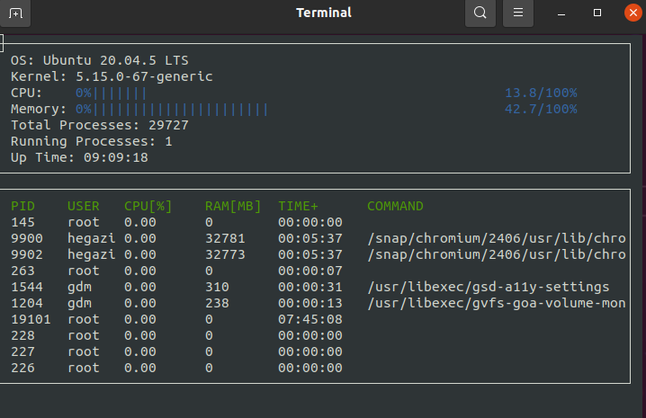

# Linux System Monitor

this project uses C++ to create a simple Linux system monitor similar to [htop](https://htop.dev/) .

Starter code for System Monitor Project in the Object Oriented Programming Course of the [Udacity C++ Nanodegree Program](https://www.udacity.com/course/c-plus-plus-nanodegree--nd213)
The starter code is available on GitHub: https://github.com/udacity/CppND-System-Monitor.

## ncurses
[ncurses](https://www.gnu.org/software/ncurses/) is a library that facilitates text-based graphical output in the terminal. This project relies on ncurses for display output.

install ncurses within your own Linux environment: `sudo apt install libncurses5-dev libncursesw5-dev`

## Make
This project uses [Make](https://www.gnu.org/software/make/). The Makefile has four targets:
* `build` compiles the source code and generates an executable
* `format` applies [ClangFormat](https://clang.llvm.org/docs/ClangFormat.html) to style the source code
* `debug` compiles the source code and generates an executable, including debugging symbols
* `clean` deletes the `build/` directory, including all of the build artifacts

## How to build and run

1. Clone the project repository: `git clone https://github.com/Y-Hegazi/Linux-System-Monitor-.git`

2. install ncurses using the command above. 

3. Build the project: `make build`

4. Run the resulting executable: `./build/monitor`

## System information
System information for the process manager is derived from the "/proc" directory and "/etc/passwd".
for more information enter `man proc` from command line.

